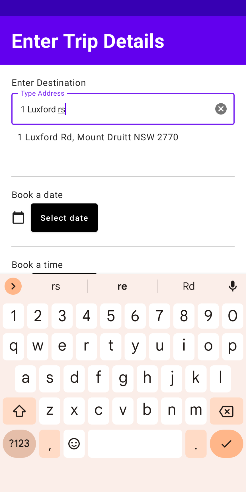

## General info
CarCollab is an app that allows you to share a car between a group of friends. 

It is a prototype Android Mobile Application built by a group of students for a final year project.

## Authors
* Simon Rahtz
* Weihao Han
* Shane Tate

## Preview
Here are some screenshots from the app.

## Demonstration
Video walkthrough: 

	
## Technologies
Project is created with:

   

	
## Setup
To run this project import it into Android Studio and run it on the emulator.

